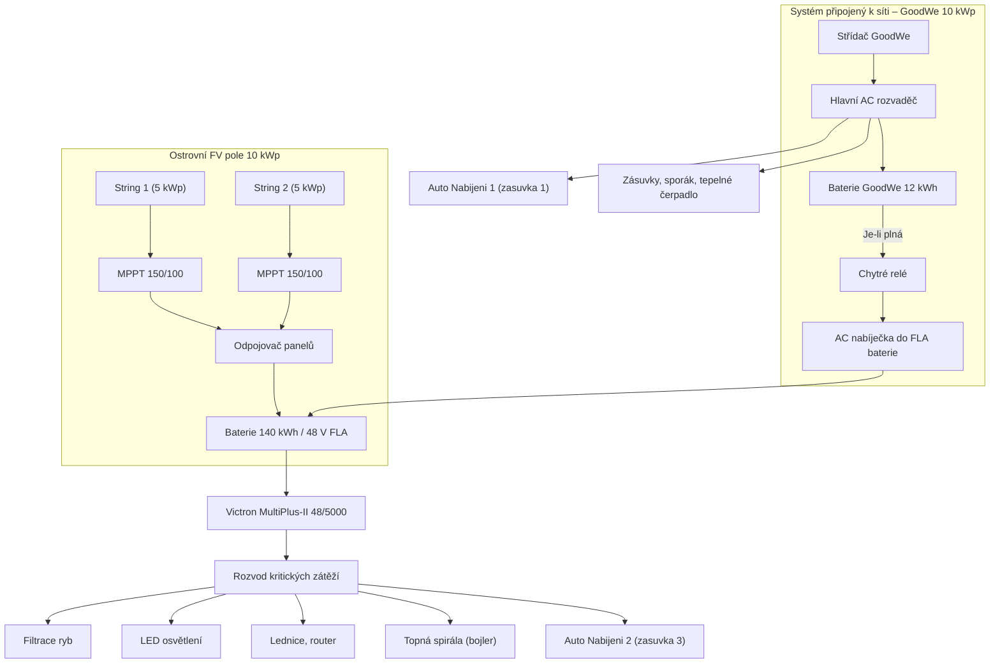
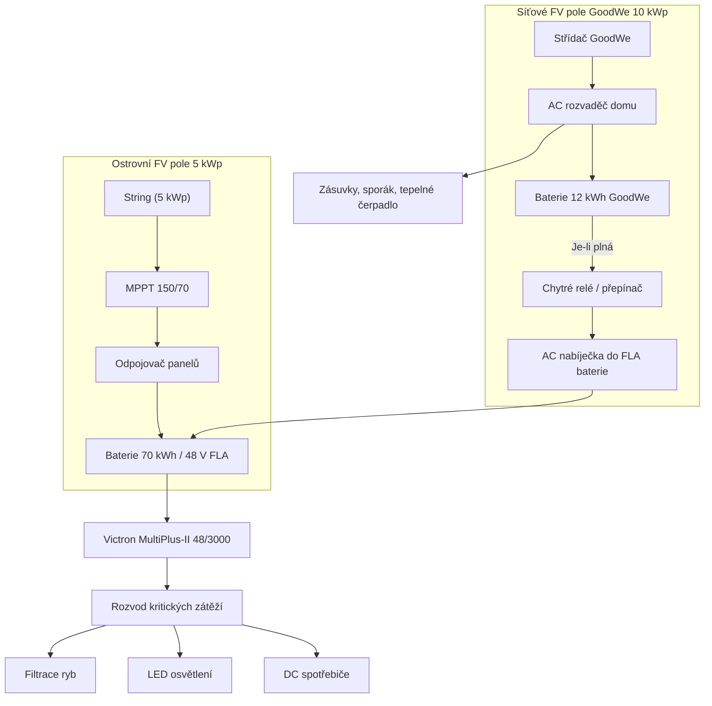

# Systémový Návrh: Expanse Solaru Velenice

---

### ✅ Přehled Systému – dvě varianty

#### Varianta A – 10 kWp / 140 kWh (Plný výkon)

| Položka                   | Parametr                                |
|-----------------------------|------------------------------------------|
| **Off-grid FV pole**       | 10 kWp, bifaciální panely (skleník)       |
| **Baterie**                | 140 kWh FLA (Flooded Lead Acid), 48 V     |
| **MPPT regulátory**        | Victron SmartSolar MPPT 150/100 (2x)     |
| **Měnič/střídač**          | Victron MultiPlus-II 48/5000/70           |
| **Monitoring**             | Victron Cerbo GX + SmartShunt             |
| **Zálohované výstupy**     | Rybník filtrace, osvětlení, lednička, Wi-Fi, topná spirála v AKU nádrži |
| **On-grid systém**         | GoodWe 10 kWp (nelze upravit)            |
| **Nabíjení EV**            | Pouze v létě (manuálně)                  |

#### Varianta B – 5 kWp / 70 kWh (Zmenšený systém)

| Položka                   | Parametr                                |
|-----------------------------|------------------------------------------|
| **Off-grid FV pole**       | 5 kWp, bifaciální panely (skleník)        |
| **Baterie**                | 70 kWh FLA (např. 48 V / 1450 Ah)          |
| **MPPT regulátory**        | Victron SmartSolar MPPT 150/70 (1x)       |
| **Měnič/střídač**          | Victron MultiPlus-II 48/3000/35           |
| **Monitoring**             | Cerbo GX nebo Color Control GX            |
| **Zálohované výstupy**     | Rybník, LED osvětlení, základní DC zátěže  |
| **Rozšiřitelnost**         | Možnost pozdějšího navýšení               |

---

### ♻️ Sezónní Provoz (A i B)

#### ❄️ Zima (listopad - únor)
- Varianta A: produkce 3–6 kWh/den, prioritizace všech kritických zátěží
- Varianta B: produkce 2–4 kWh/den, prioritizace pouze rybníku a základního světla

#### ☀️ Léto (březen - říjen)
- Varianta A: přebytky až 50–60 kWh/den, možné EV nabíjení, topná spirála v AKU nádrži
- Varianta B: pokrytí základních zátěží + občasné přepínání zátěží z gridu

---

### ⚡ Řízení systému (Cerbo GX)

| Pravidlo | Podmínka                           | Akce (A/B)                         |
|----------|------------------------------------|-----------------------------------|
| R1       | SoC < 35 %, čas 22:00–06:00        | Vypni osvětlení (A i B)           |
| R2       | SoC < 30 %                         | Vypni vše kromě rybníku (A i B)   |
| R3       | SoC > 60 %, FV > 500 W             | Zapni lednici, router (jen A)     |
| R4       | SoC > 80 %, čas 10:00–16:00, léto  | Povolit EV nabíjení, topnou spirálu (jen A) |
| R5       | SoC > 95 %, žádné aktivní zátěže   | Odpojit FV vstup (relé nebo Remote OFF MPPT) |

---

...(předchozí obsah beze změny)...

---

### 🖼 Podrobné zapojení – Varianta A (aktualizováno s duálním nabíjením)

> **Poznámka:** Stejná logika programovatelného relé platí i zde. Jakmile je 12kWh baterie GoodWe plně nabita, AC výstup se přepne do ostrovního systému pomocí vhodné AC nabíječky.

---
### 🖼 Podrobné zapojení – Varianta B (aktualizováno s duálním nabíjením)

> **Poznámka:** Programovatelné přepínací relé řízené SoC sledováním může přesměrovat přebytečný výkon ze sítě (GoodWe) do ostrovní baterie pomocí Victron Phoenix Charger nebo jiné vhodné AC nabíječky.

> **Poznámka:** Programovatelné relé řízené Cerbo GX spíná AC nabíječku:
pokud je GoodWe baterie plná nebo
pokud je SoC FLA baterie pod 50 %
Tím je zajištěna minimální dostupnost energie pro kritické zátěže i při slabém slunečním svitu.

---

### 🛠️ Montážní plán a instalační poznámky

#### Montáž panelů (skleník / polykarbonátová střecha)

* Použít hliníkové C-profily na ocelové nosníky pod polykarbonátem
* Zajistit větrací mezeru min. 10 cm pod panely
* Použít manuálně naklápěcí úchyty: \~25° léto / \~45° zima (nastavení 2× ročně)

#### Umístění baterií

* Dobře větrané, chladné místo (ideálně sklep nebo technická místnost)
* Na nevodivou podložku s ochranou proti elektrolytu
* Vzdálenost k měniči max. 2 metry kvůli ztrátám

#### Kabeláž a jištění

* DC stringy chráněny jističem 25 A / 100 VDC
* AC výstup z měniče chráněn 25 A dvoupólovým jističem
* Signální kabely (VE.Bus, SmartShunt) vést odděleně od silových

#### Cerbo GX + chytré relé

* Cerbo GX sleduje SoC a řídí logiku přepínání
* Chytré relé (např. Victron Digital Input Relay nebo Shelly Pro) sepne AC nabíječku, jakmile je 12kWh baterie plná
* Doporučená nabíječka: Victron Phoenix Charger 24/48 V

