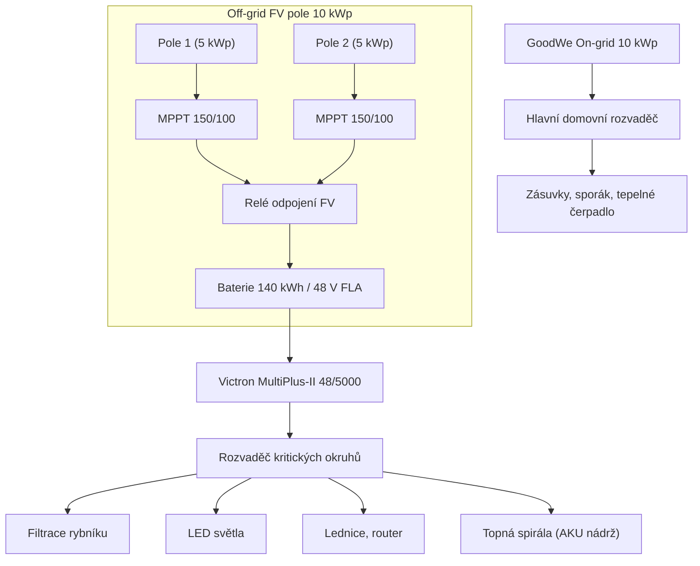
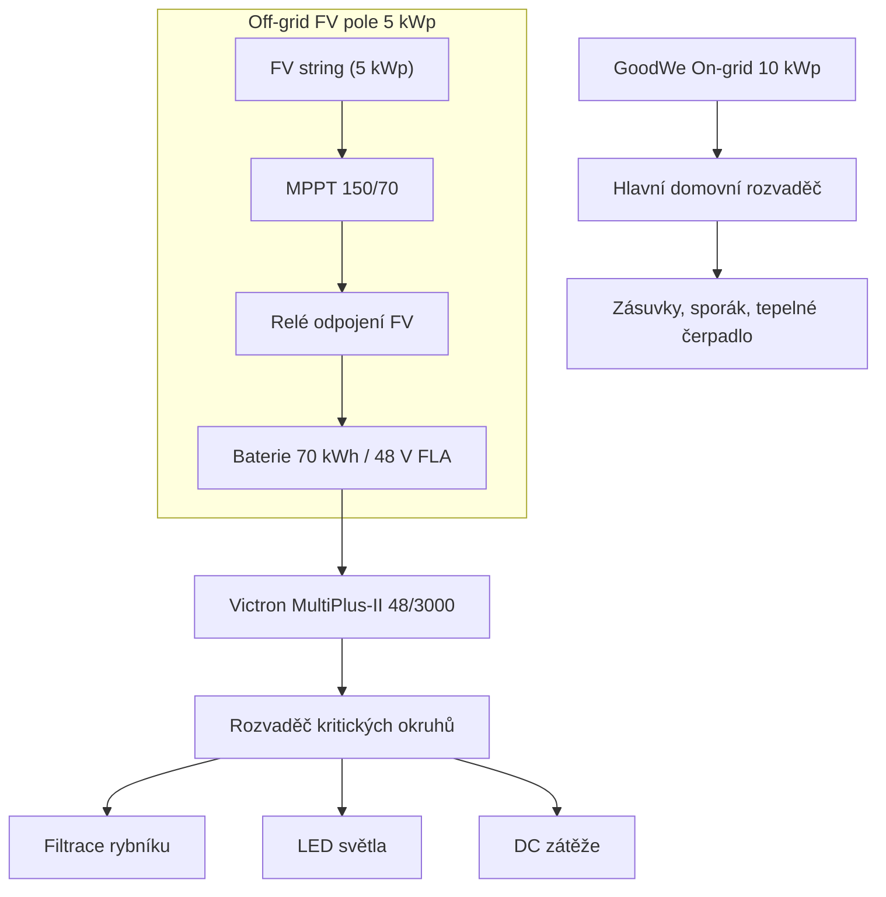

# Systémový Návrh: Expanse Solaru Velenice

---

### ✅ Přehled Systému – dvě varianty

#### Varianta A – 10 kWp / 140 kWh (Plný výkon)

| Položka                   | Parametr                                |
|-----------------------------|------------------------------------------|
| **Off-grid FV pole**       | 10 kWp, bifaciální panely (skleník)       |
| **Baterie**                | 140 kWh FLA (Flooded Lead Acid), 48 V     |
| **MPPT regulátory**        | Victron SmartSolar MPPT 150/100 (2x)     |
| **Měnič/střídač**          | Victron MultiPlus-II 48/5000/70           |
| **Monitoring**             | Victron Cerbo GX + SmartShunt             |
| **Zálohované výstupy**     | Rybník filtrace, osvětlení, lednička, Wi-Fi, topná spirála v AKU nádrži |
| **On-grid systém**         | GoodWe 10 kWp (nelze upravit)            |
| **Nabíjení EV**            | Pouze v létě (manuálně)                  |

#### Varianta B – 5 kWp / 70 kWh (Zmenšený systém)

| Položka                   | Parametr                                |
|-----------------------------|------------------------------------------|
| **Off-grid FV pole**       | 5 kWp, bifaciální panely (skleník)        |
| **Baterie**                | 70 kWh FLA (např. 48 V / 1450 Ah)          |
| **MPPT regulátory**        | Victron SmartSolar MPPT 150/70 (1x)       |
| **Měnič/střídač**          | Victron MultiPlus-II 48/3000/35           |
| **Monitoring**             | Cerbo GX nebo Color Control GX            |
| **Zálohované výstupy**     | Rybník, LED osvětlení, základní DC zátěže  |
| **Rozšiřitelnost**         | Možnost pozdějšího navýšení               |

---

### ♻️ Sezónní Provoz (A i B)

#### ❄️ Zima (listopad - únor)
- Varianta A: produkce 3–6 kWh/den, prioritizace všech kritických zátěží
- Varianta B: produkce 2–4 kWh/den, prioritizace pouze rybníku a základního světla

#### ☀️ Léto (březen - říjen)
- Varianta A: přebytky až 50–60 kWh/den, možné EV nabíjení, topná spirála v AKU nádrži
- Varianta B: pokrytí základních zátěží + občasné přepínání zátěží z gridu

---

### ⚡ Řízení systému (Cerbo GX)

| Pravidlo | Podmínka                           | Akce (A/B)                         |
|----------|------------------------------------|-----------------------------------|
| R1       | SoC < 35 %, čas 22:00–06:00        | Vypni osvětlení (A i B)           |
| R2       | SoC < 30 %                         | Vypni vše kromě rybníku (A i B)   |
| R3       | SoC > 60 %, FV > 500 W             | Zapni lednici, router (jen A)     |
| R4       | SoC > 80 %, čas 10:00–16:00, léto  | Povolit EV nabíjení, topnou spirálu (jen A) |
| R5       | SoC > 95 %, žádné aktivní zátěže   | Odpojit FV vstup (relé nebo Remote OFF MPPT) |

---

### 🖼 Detailní zapojení – varianta A

---

### 🖼 Detailní zapojení – varianta B

---

### 🛠️ Montážní plán a instalační poznámky

#### Uchycení panelů (skleník / polykarbonát)
- Hliníkové C-profily na příčných ocelových nosnících pod polykarbonátem
- Mezera min. 10 cm pod panely
- Naklápěcí úchyt 25–45° pro letní/zimní sezónu (2× ročně)

#### Umístění baterie
- Chladné a větrané místo (technická místnost/sklep)
- Odolná nevodivá podložka, ochrana proti elektrolytu
- Do 2 metrů od měniče (min. ztráty)

#### Vedení a jištění
- DC jističe min. 25 A / 100 VDC
- AC výstup jištěn 25 A jističem
- Monitoringové vedení odděleně od silového

#### Cerbo GX
- Instalace vedle měniče
- GX Touch na přístupném místě
- Přístup přes Victron VRM

---

**Verze: 1.6 / 06-2025**  
**Projekt: Expanse Solaru Velenice – Plná i kompaktní varianta**  
**Kontakt: [vlastník / projektant]**
