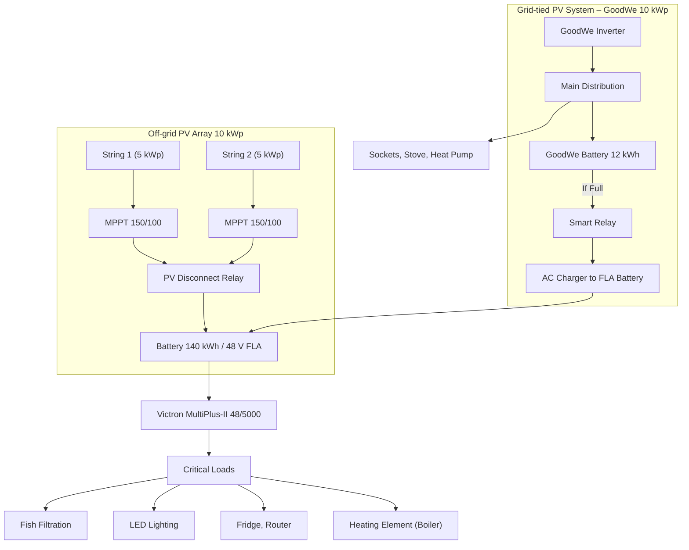

# System Design: Expanse Solar Velenice

---

### ✅ System Overview – Two Variants

#### Variant A – 10 kWp / 140 kWh (Full Capacity)

| Item                      | Specification                                |
|---------------------------|-----------------------------------------------|
| **Off-grid PV Array**     | 10 kWp, bifacial panels (mounted on greenhouse) |
| **Battery**               | 140 kWh Flooded Lead Acid (FLA), 48 V         |
| **MPPT Controllers**      | Victron SmartSolar MPPT 150/100 (2 units)     |
| **Inverter/Charger**      | Victron MultiPlus-II 48/5000/70               |
| **Monitoring**            | Victron Cerbo GX + SmartShunt                 |
| **Backed-up Loads**       | Fish filtration, lights, fridge, Wi-Fi, heating element in storage tank |
| **On-grid System**        | GoodWe 10 kWp (non-modifiable)                |
| **EV Charging**           | Manual in summer only                         |

#### Variant B – 5 kWp / 70 kWh (Reduced Capacity)

| Item                      | Specification                                 |
|---------------------------|-----------------------------------------------|
| **Off-grid PV Array**     | 5 kWp, bifacial panels (greenhouse)           |
| **Battery**               | 70 kWh FLA (e.g., 48 V / 1450 Ah)             |
| **MPPT Controller**       | Victron SmartSolar MPPT 150/70 (1 unit)       |
| **Inverter/Charger**      | Victron MultiPlus-II 48/3000/35               |
| **Monitoring**            | Cerbo GX or Color Control GX                  |
| **Backed-up Loads**       | Fish tank, LED lighting, basic DC loads       |
| **Scalability**           | Future upgrade possible                       |

---

### ♻️ Seasonal Operation (Both Variants)

#### ❄️ Winter (Nov – Feb)
- Variant A: production 3–6 kWh/day, all critical loads prioritized
- Variant B: production 2–4 kWh/day, only fish tank and lighting prioritized

#### ☀️ Summer (Mar – Oct)
- Variant A: excess up to 50–60 kWh/day, optional EV charging and hot water heating
- Variant B: basic load coverage, occasional grid substitution

---

### ⚡ System Logic (Cerbo GX)

| Rule | Condition                              | Action (A/B)                                 |
|------|----------------------------------------|----------------------------------------------|
| R1   | SoC < 35%, between 22:00–06:00         | Turn off lights (A and B)                    |
| R2   | SoC < 30%                              | Turn off everything except fish system       |
| R3   | SoC > 60%, PV > 500 W                  | Turn on fridge and router (A only)           |
| R4   | SoC > 80%, 10:00–16:00, summer         | Enable EV and water heating (A only)         |
| R5   | SoC > 95%, no active loads             | Disconnect PV via relay or MPPT Remote OFF   |

---

### 🖼 Detailed Wiring – Variant A (Updated with Dual Charging)



> **Note:** The same programmable relay logic applies here. When the 12 kWh GoodWe battery is full, AC output is rerouted to charge the 140 kWh FLA battery via a suitable AC charger.
---

### 🖼 Detailed Wiring – Variant B (Updated with Dual Charging)

```mermaid
flowchart TD
    subgraph Panels_B [Off-grid PV Array 5 kWp]
        PB1["PV String (5 kWp)"] --> MPPT_B["MPPT 150/70"]
        DIS_B["PV Disconnect Relay"]
        MPPT_B --> DIS_B --> BATB["Battery 70 kWh / 48 V FLA"]
    end

    subgraph Panels_Grid [Grid-tied PV System (GoodWe 10 kWp)]
        GW_INV["GoodWe Inverter"] --> AC_MAINB["Main House Distribution Panel"]
        AC_MAINB --> GW_BATT["Battery 12 kWh (GoodWe)"]
        GW_BATT -->|If Full| TRANSFER["Smart Relay / Transfer Switch"] --> CHG_CTRL["AC Charger to 70 kWh Battery"] --> BATB
    end

    BATB --> MPB["Victron MultiPlus-II 48/3000"]
    MPB --> AC_B_OUT["Critical Loads Distribution Panel"]
    AC_B_OUT --> L1B["Fish Tank Filtration"]
    AC_B_OUT --> L2B["LED Lighting"]
    AC_B_OUT --> L3B["DC Loads"]

    AC_MAINB --> L4B["Sockets, Stove, Heat Pump"]
```

> **Note:** A programmable transfer switch or contactor controlled by SoC monitoring of the 12 kWh battery can redirect surplus power from the GoodWe inverter (via AC) into the off-grid battery system through a Victron Phoenix Charger or similar AC charger.

---

### 🛠️ Mounting Plan and Installation Notes

#### PV Mounting (Greenhouse / Polycarbonate Roof)
- Use aluminum C-profiles on steel beams under the polycarbonate
- Maintain at least 10 cm ventilation gap below panels
- Use manual tilting brackets: ~25° summer / ~45° winter (adjust 2x/year)

#### Battery Placement
- Well-ventilated, cool space (basement or utility room recommended)
- On non-conductive tray with electrolyte spill protection
- Max distance to inverter: 2 meters to reduce loss

#### Cabling and Protection
- DC strings protected by 25 A / 100 VDC breakers
- Inverter AC output protected by 25 A dual-pole circuit breaker
- Signal cables (VE.Bus, SmartShunt) routed separately from power

#### Cerbo GX Placement
- Mount near the inverter
- GX Touch placed in visible location
- Remote monitoring via Victron VRM portal

#### Cerbo GX + Smart Relay

* Cerbo GX handles SoC tracking and state logic
* Smart relay (e.g. Victron Digital Input Relay or Shelly Pro) triggers AC charger once 12 kWh battery reaches full
* AC charger recommended: Victron Phoenix Charger 24/48 V

---

**Version: 1.6 / 06-2025**  
**Project: Expanse Solar Velenice – Full and Compact Variants**  
**Contact: [Owner / Designer]**
